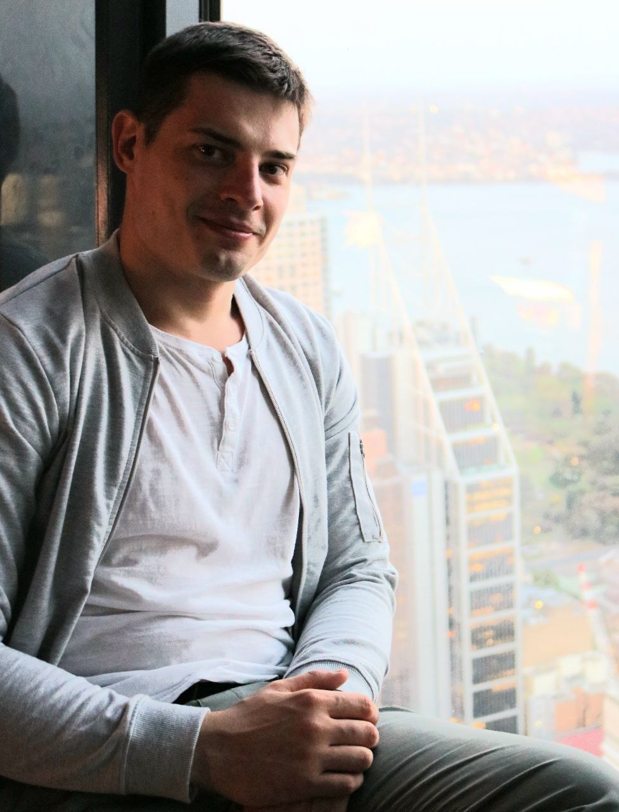

# Viacheslav Kopytov  



***

#### F r o n t- E n d  D e v e l o p e r

>### PERSONAL PROFILE
<br>

<p>Viacheslav Kopytov I have 12 years experiance in
marine engineer capacity. During this time i made my
way from a cadet to a senior engineer. Prerform tasks
of defferent complexity, like single engineer and as a
project manager and always followed company policy.
All these years i worked in multinational crews,hance i
have excellent experiance of working in a team with
people of defferent cultures. I`m a friendly,responsive
and disciplined person.</p>

>### WORK EXPERIANCE


#### Marine Engineer BSM

*January 2011 - till November 2021 I World Wide*

* Prepared and distributed daily reports on crew
routine issues and progress.
* Supervised other engineers and crew memebers
and trained for routine and emergency duties.
* Supervised and trained engineers in routine
and emergency duties
* Implement best ptactices and
troubleshooting techniques to resolve
machinery issues.

***

>### EDUCATION HISTORY


### Kyiv National maritime academy

*January 2011 - till November 2021 I World Wide*

* Specialist in operation of marine
powerplant

### Beetroot academy

*Oct 2022 - Jan 2023*

* Front-End developer- course 

***

>### TEACH SKILLS

* HTML
* CSS3
* JavaScript (Fundamentals, ES6+, DOM, JSON)

```
{
    fetch(API)
        .then(response=>{
            return response.json()
        })
        .then(data=>{data.main})
}
```

> ### Codewars example


```
Consider an array/list of sheep where some sheep may be missing 
from their place. We need a function that counts the number 
of sheep present in the array (true means present).

[true,  true,  true,  false,
  true,  true,  true,  true ,
  true,  false, true,  false,
  true,  false, false, true ,
  true,  true,  true,  true ,
  false, false, true,  true]

  function countSheeps(arrayOfSheep) {
let sheep=0

for (let i=0; i<arrayOfSheep.length; i++){
    if(arrayOfSheep[i]==true){
        sheep+=arrayOfSheep[i]
    }
}
  return sheep
}

```

***

>### SOFT SKILLS

* EF SET - C1 level. And participating in eglish speaking club twice a week.

>

* Polish (basic speaking level)
* Flexible in working
hours.

***

> #### CONTACT ME AT


```

tel:         067 505 96 25
e-mail:      vachek0602@gmail.com
location:    Kyiv., Ukraine
discord:     Viacheslav#5786
GitHub:      Vachek-hooves

```
